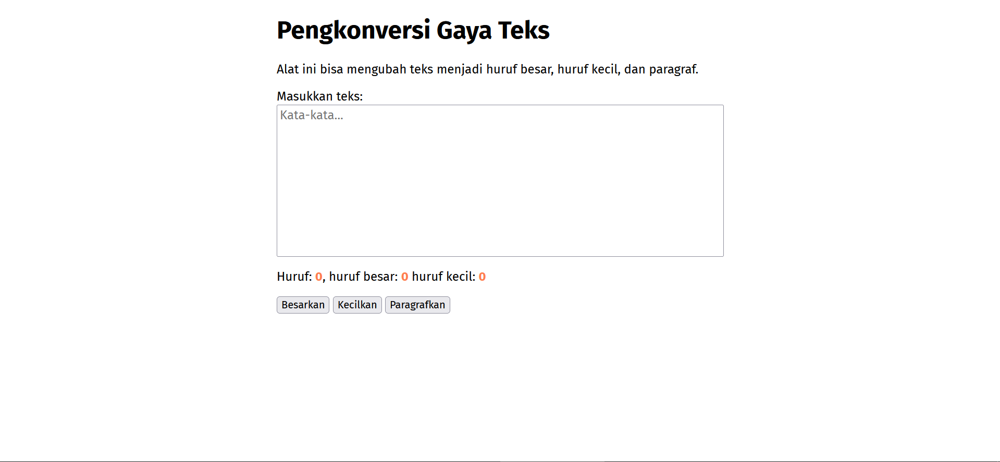

# Tugas Mandiri : GUI dengan HTML dan CSS

**Nama**:Andhika Fikri Ekanatha  
**NIM**:103122400059  
**Kelas**:SE-08-02

##  TUGAS 

Buatlah tata letak laman yang kamu buat berada di tengah seperti di bawah ini, dan juga ubah font-nya dengan Inconsolata dari Google Fonts.

## PROGRAM KODE

Tersedia di [index.html](./index.html), [index.js](./index.js) dan [index.css](./index.css)

## OUTPUT

## DESKRIPSI

 untuk tata letak halaman diposisikan ke tengah menggunakan max-width dan margin auto pada elemen body. Untuk tipografi,   pakai font 'Inconsolata' yang diterapkan pada body.

